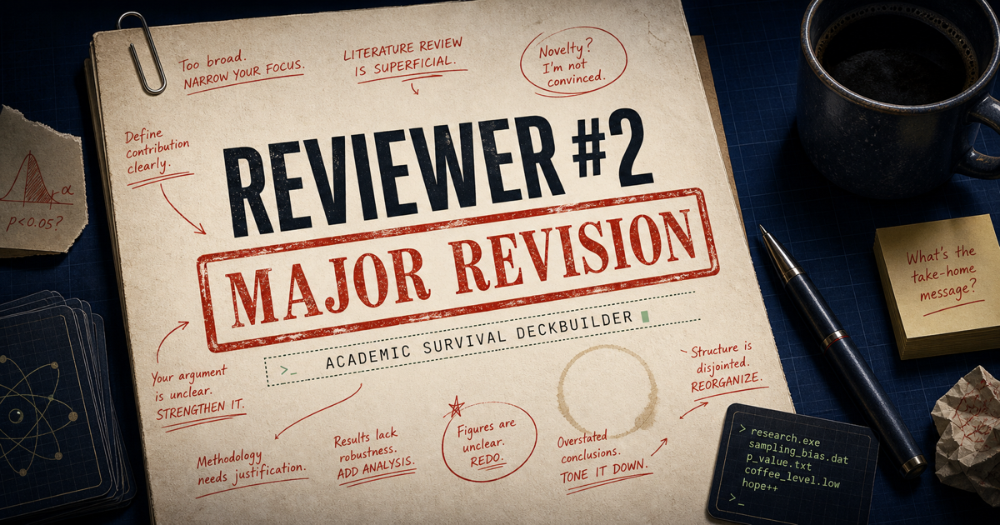
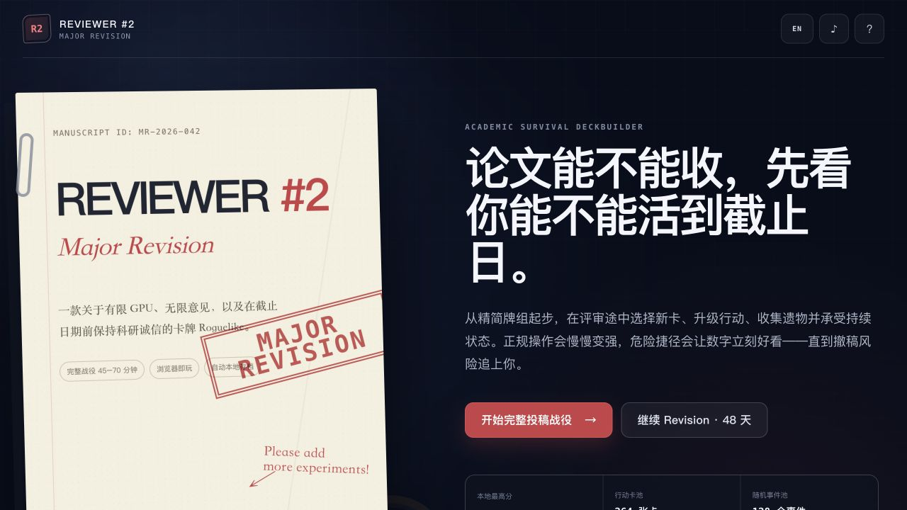
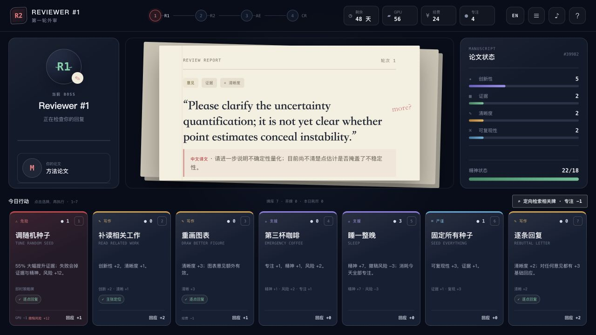

# Reviewer #2: Major Revision

> **5 review difficulties. 6 campaign lengths. 528 action cards. 256 interactive story events. 16 endings.**
>
> Can you survive Reviewer #2 long enough to receive the Decision Letter?

*Click the cover to play the online edition.*

## Play now

### [▶ Play online — no installation](https://voyager0057.github.io/reviewer-2-major-revision/)

### [⬇ Download the single-file offline edition](https://github.com/Voyager0057/reviewer-2-major-revision/raw/refs/heads/main/Reviewer-2-Major-Revision.html)

The offline edition is one self-contained HTML file. Download `Reviewer-2-Major-Revision.html` and double-click it—no installer, terminal, server, account, or internet connection is required.

## What is it?

**Reviewer #2: Major Revision** is a multilingual academic-survival deckbuilding roguelike.

You are a researcher trying to revise a paper before the deadline while managing GPU time, funding, focus, mental health, and retraction risk. Every reviewer comment contains concrete capability requirements. A statistically powerful card cannot magically solve a missing baseline, and another experiment cannot repair an unreadable argument unless its capabilities match the selected response route.

Each day asks uncomfortable questions:

- Spend the GPU budget on external validation or the reviewer's requested ViT-Large?
- Report a failed experiment honestly or tune one more random seed?
- Improve the evidence now or protect your mental health for the next round?
- Fix the infrastructure outage, negotiate with your advisor, or accept that the server has entered its own sabbatical?

## Screenshots

*Open the submission portal, configure a campaign, and begin the next academic crisis.*

*Choose a response route, inspect its exact capability steps, and play cards that genuinely address the review.*

## The Archive Update

- **528 action cards** covering experiments, statistics, writing, reproducibility, collaboration, and questionable shortcuts, each with a short research-life vignette
- **160 reviewer comments** with three response routes and explicit capability requirements
- **256 illustrated interactive story events** across infrastructure, clusters, advisors, coauthors, data, ethics, funding, open science, competition, and submission systems. Seventeen hand-painted scenes are assigned by event family first, with topic-aware matching for older events.
- A seven-scene **cinematic title gallery** spanning revision night, campus blackout, deadline dawn, reviewer tribunal, paper nightmare, camera-ready aftermath, and the poster hall—with manual navigation, pause, and reduced-motion support
- **20 manuscript archetypes**, each with a different starting deck, passive ability, and reviewer weakness
- **48 research relics** and **40 revision tasks**
- **16 endings**, including Best Paper, Open Science Hero, Replication Legend, Clean Review, speedrun, last-minute upload, Minor Revision, Major Revision, R&R, rejection, burnout, and retraction
- A game-style title screen with a left command menu and an animated late-night laboratory
- A persistent **Submission Archive** for past runs, career statistics, discovered response routes, events, relics, cards, and endings
- Shared main-menu and in-game settings for motion, contrast, reading size, paper texture, card density, sound, ambient light, and dangerous-action confirmation
- Autosave, three manual save slots, Ironman mode, deterministic seeds, exportable career history, local high scores, and shareable ending cards

## How a run works

1. **Configure the submission.** Choose a manuscript archetype, review difficulty, campaign length, seed, custom rules, and optional Ironman mode.
2. **Read the review.** Every comment offers Full Verification, Narrow the Claim, and Transparent Response routes.
3. **Match capabilities.** Cards advance only the route steps they actually support: baseline comparison, statistics, data integrity, external validation, calibration, documentation, claim framing, and more.
4. **Build the deck.** Resolve comments to draft new cards, upgrade actions, and earn relics that alter the rules of the run.
5. **Live through the scene.** Choose an approach, make two more decisions as the situation develops, and discover the consequences through character dialogue and the scene's conclusion.
6. **Read the submission timeline.** Important reviews, rewards, events, stage transitions, and editorial decisions are recorded separately from the short action log.

## Campaign setup

### Review difficulty

| Difficulty | What changes |
| --- | --- |
| Friendly Pre-review | More resources and softer requirements; ideal for a first submission |
| Constructive Feedback | Full mechanics with slightly lower pressure |
| Standard Major Revision | Recommended default balance |
| Reviewer #2 Unleashed | Harder comments, tighter resources, and harsher delays |
| Editorial Inferno | Severe requirements and frequent crises, with the highest score multiplier |

### Campaign length

| Campaign | Scale | Estimated play time |
| --- | --- | --- |
| Espresso Rebuttal | 18 days / 14 comments | 12–20 minutes |
| Conference Sprint | 30 days / 24 comments | 25–40 minutes |
| Full Major Revision | 48 days / 40 comments | 45–70 minutes |
| Journal Marathon | 72 days / 60 comments | 70–105 minutes |
| Eternal Revision | 96 days / 80 comments | 100–150 minutes |
| Custom Review Contract | 12–120 days / 10–100 comments | You decide |

Ironman keeps a crash-safe autosave but disables manual saving and rollback. It remains an honor system—players still own their browser developer tools.

## Interactive events

Events are illustrated academic-comedy stories rather than immediate stat popups. Seventeen reusable hand-painted scenes distinguish blackouts, server maintenance, advisor rewrites, missing coauthors, ethics boards, lab wellbeing, competing preprints, clinical validation, funding freezes, collaboration, publicity, administration, data-leakage audits, camera-ready chaos, and submission emergencies. The 128 grand-expansion events use explicit family-to-art assignments; older events use topic-aware matching rather than arbitrary random art.

1. A lab outage, maintenance window, advisor interruption, data shift, coauthor crisis, or equally plausible disaster occurs.
2. You see the choices, but not their numerical rewards or costs.
3. Your first decision locks the broad approach; two contextual follow-up choices determine how the conversation and response actually unfold.
4. The event becomes a compact story with readable scene-setting, character dialogue, reactions, and a final narrative beat.
5. The result report reveals the **actual applied changes**, including the hidden effects of all three decisions, caps, relic protection, conditions, card additions or removals, and upgrades.
6. The full decision path enters the persistent submission timeline.

## Languages

English is the default language. Use the language selector at any time to switch between:

- English
- 简体中文
- 日本語
- 한국어
- Español

English and Simplified Chinese include the complete long-form card, reviewer, and story content. Japanese, Korean, and Spanish localize navigation, campaign setup, resources, core actions, saves, events, and help; long-form research content without a dedicated translation falls back to English so that rules remain complete and unambiguous.

Your language preference is stored locally in the browser.

## Saves and privacy

- The current run is continuously autosaved.
- The pause menu provides three independent manual archive slots.
- Save metadata shows manuscript type, progress, days remaining, difficulty, campaign length, timestamp, and seed.
- Ironman disables manual saving and loading while retaining crash recovery.
- Completed runs enter a separate career archive. It tracks aggregate statistics and discovered content without storing or uploading manuscript files.
- Career history can be exported as JSON or erased independently without deleting an active run.
- Saves and high scores stay in local browser storage. No manuscript, research data, or personal information is uploaded.
- Online and offline editions normally have separate save storage.

## Beginner tips

- Read the route's capability checklist before choosing a card. A high-value but irrelevant card will not solve the comment.
- Full Verification is expensive but reliable. Narrow the Claim is faster but may reduce Novelty. Transparent Response can lower risk and build editor trust.
- A failed result is not always a failed run. Honest negative results can improve reproducibility and reduce retraction risk.
- Sleep is research infrastructure maintenance, not a wasted turn.
- Reviewer #2 will add requirements. Keep GPU time and funding in reserve for the later stages.

<strong>简体中文玩家指南</strong>

《Reviewer #2: Major Revision》是一款学术生存卡牌 Roguelike。英语是首次启动时的默认语言；在主菜单或游戏顶部的语言选择器中选择 **简体中文**，即可切换中文界面。浏览器会记住你的语言设置。

你需要在截止日期前管理 GPU、经费、专注、精神状态和撤稿风险，并处理与卡牌能力直接关联的审稿意见。每条意见提供三条解决路线；只有真正匹配所需能力的卡牌才能推进对应步骤。

事件会用十七张论文风插图建立场景，分别覆盖断电、服务器维修、导师重写、合作者失联、伦理审查、研究者状态、竞争预印本、临床外部验证、经费冻结、开放协作、宣传危机、学院行政、数据泄漏审计、终稿格式事故和投稿系统等主题。128 个大型扩展事件按事件家族明确配图，旧事件再根据题材智能匹配，不会随机贴图。你先决定怎么处理，再随着人物对话和现场变化连续做出两次更具体的选择；故事结尾才自然显露后果，并把完整经历写进投稿时间线。每张手牌也新增了一句双语科研生活小故事。

主菜单采用左侧游戏选项、右侧七幕手绘叙事画廊的布局，依次呈现深夜返修、校园断电、截稿黎明、匿名评审庭、审稿噩梦、终稿后的清晨和录用后的海报现场；支持自动轮播、前后切换、指定场景、暂停以及减少动态模式。投稿档案室会记录历史战役、生涯统计，以及发现过的解决路线、事件、卡牌、遗物和结局。帮助页面只保留玩法说明；显示、声音、动画、字号、卡面密度和危险操作确认可以在主菜单与游戏内共同调整。

游戏包含 528 张行动卡、160 条审稿意见、256 个互动故事事件、20 种论文类型、48 件遗物、5 档难度、6 种周期和 16 种结局。支持自动存档、三个手动存档槽、铁人模式、可导出的本地战役档案、本地最高分和单文件离线游玩。

- [在线开始游戏](https://voyager0057.github.io/reviewer-2-major-revision/)
- [下载单文件离线版](https://github.com/Voyager0057/reviewer-2-major-revision/raw/refs/heads/main/Reviewer-2-Major-Revision.html)

## Publishing

Maintainer instructions for GitHub Pages and the downloadable offline release are in [PUBLISHING.md](PUBLISHING.md).
